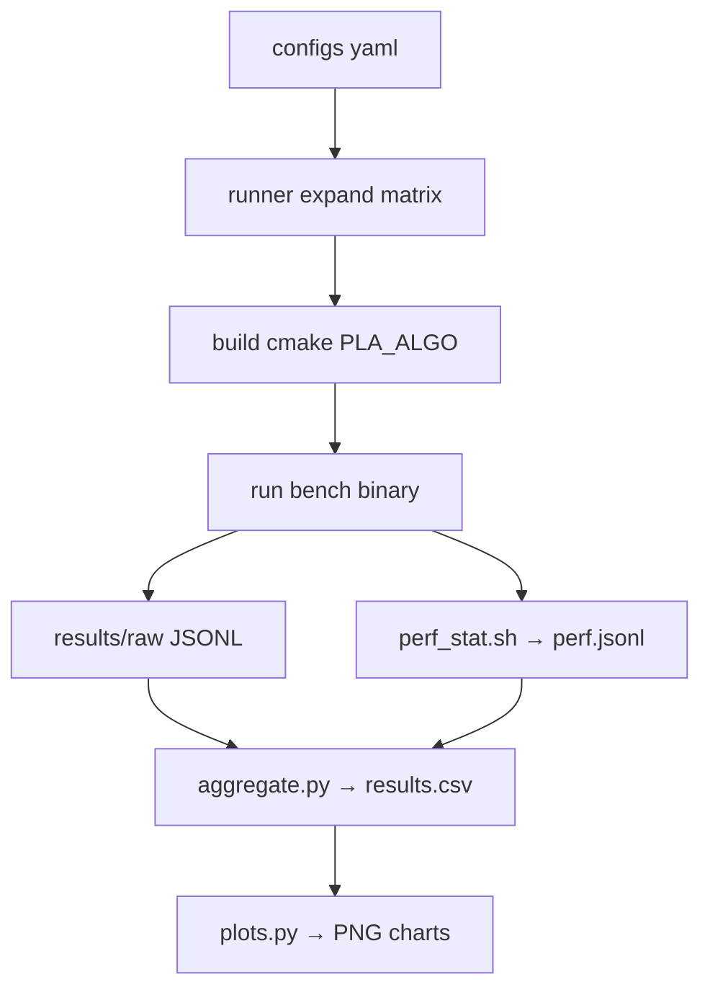

# pla-learned-index-bench

A reproducible benchmark harness for **Piecewise Linear Approximation (PLA)**-based
learned index structures, covering in-memory, dynamic, and on-disk scenarios.

## Overview

| Scenario | Index | PLA source |
|---|---|---|
| `pla_only` | — | standalone build/verify |
| `inmem` | PGM-index | `internal::make_segmentation[_par]` |
| `dynamic` | LOFT | wrapped microbench |
| `ondisk` | Efficient-Disk-Learned-Index | `PGMIndexPage` |

Three PLA algorithms are selectable at compile time (`-DPLA_ALGO=`):

| Algorithm | Space | Pivot | Source |
|---|---|---|---|
| `optimal` | O(n) | — | PGM-index `make_segmentation_par` |
| `swing` | O(1) per seg | segment start | FITing-Tree `lower_slope/upper_slope` |
| `greedy` | O(1) per seg | midpoint of p1,p2 | PLABench §3.3 |

## Repository structure

```
pla-learned-index-bench/
├── CMakeLists.txt
├── third_party/
│   ├── PGM-index/          # submodule — OptimalPLA
│   ├── FITing-Tree/        # submodule — SwingFilter reference
│   ├── LOFT/               # submodule — dynamic workload
│   ├── Efficient-Disk-Learned-Index/  # submodule — on-disk benchmark
│   └── SOSD/               # submodule — datasets & baselines
├── pla/
│   ├── include/pla/
│   │   ├── pla_api.h       # unified interface
│   │   ├── alg_optimal.h   # OptimalPLA (wraps PGM-index internals)
│   │   ├── alg_swing.h     # SwingFilter
│   │   └── alg_greedy.h    # GreedyPLA
├── adapters/               # minimal patch files per submodule
├── bench/
│   ├── pla_only/           # build + verify only
│   ├── inmem/              # end-to-end lookup
│   ├── dynamic/            # insert/lookup mixed workload
│   └── ondisk/             # page-level fetch strategies
├── tools/
│   ├── runner/run.py       # YAML → matrix → build → run → JSONL
│   └── viz/                # aggregate.py, plots.py
├── scripts/
│   ├── bootstrap_ubuntu22.sh
│   ├── apply_patches.sh
│   ├── drop_caches.sh
│   ├── perf_stat.sh
│   └── datasets/           # gen_synth.py, split_shards.py
├── configs/
│   └── exp_example.yaml
└── results/
    ├── raw/                # per-scenario JSONL
    └── agg/                # results.csv + PNG charts + metadata.json
```

## Quick start (Ubuntu 22.04)

```bash
# 1. Install dependencies
sudo bash scripts/bootstrap_ubuntu22.sh

# 2. Update submodules
git submodule init
git submodule update --remote --recursive

# 3. Apply adapter patches
bash scripts/apply_patches.sh

# 4. Build (OptimalPLA by default)
cmake -S . -B build -DCMAKE_BUILD_TYPE=Release
cmake --build build -j$(nproc)

# 5. Run unit tests
cd build && ctest --output-on-failure && cd ..

# 6. Smoke run (tiny data, fast)
python3 tools/runner/run.py --config configs/exp_example.yaml --smoke

# 7. View results
ls results/raw/*.jsonl
ls results/agg/*.png
```

## Switching PLA algorithm

```bash
# Rebuild with SwingFilter
cmake -S . -B build -DPLA_ALGO=swing
cmake --build build -j$(nproc)

# Rebuild with GreedyPLA
cmake -S . -B build -DPLA_ALGO=greedy
cmake --build build -j$(nproc)
```

The runner (`run.py`) handles this automatically — it rebuilds once per PLA
algorithm before running the corresponding cases.

## Running experiments

```bash
# Full matrix from YAML config
python3 tools/runner/run.py --config configs/exp_example.yaml

# Only pla_only scenario, optimal algorithm
python3 tools/runner/run.py --config configs/exp_example.yaml \
    --filter-scenario pla_only --filter-pla optimal

# Dry run (print commands without executing)
python3 tools/runner/run.py --config configs/exp_example.yaml --dry-run
```

## Generating datasets

```bash
# Synthetic lognormal, 200M keys
python3 scripts/datasets/gen_synth.py \
    --dist lognormal --n 200000000 \
    --output data/synth_lognormal_200M.bin

# Split into 4 shards
python3 scripts/datasets/split_shards.py \
    --input data/synth_lognormal_200M.bin \
    --shards 4 --output-dir data/shards/lognormal_200M

# SOSD datasets (fb, books, osm)
# After initialising the SOSD submodule:
cd third_party/SOSD && bash download.sh && cd ../..
```

## On-disk benchmark

```bash
# Run with Efficient-Disk-Learned-Index submodule
cmake -S . -B build -DBUILD_ONDISK=ON
cmake --build build -j$(nproc)

# Drop page cache (requires root)
sudo bash scripts/drop_caches.sh

# Run ondisk bench, strategy 1 (all-at-once prefetch)
./build/ondisk_bench \
    --dataset data/sosd_books_800M.bin \
    --epsilon 128 --algo optimal \
    --fetch-strategy 1 --queries 100000
```

fetch_strategy codes:

| Code | Description |
|------|-------------|
| 0 | one-by-one (touch each page individually) |
| 1 | all-at-once (prefetch entire search range) |
| 2 | all-at-once-sorted (sorted page list) |
| 3 | model-biased (fetch only predicted page) |

## LOFT dynamic benchmark

LOFT requires MKL, jemalloc, and urcu:

```bash
# With MKL
cmake -S . -B build -DUSE_MKL=ON -DUSE_JEMALLOC=ON -DUSE_URCU=ON
cmake --build build -j$(nproc)
./build/dynamic_bench --algo optimal --epsilon 64 --threads 4 \
    --n 1000000 --insert-ratio 0.5

# Without MKL (fallback stub, no LOFT internals)
cmake -S . -B build -DUSE_MKL=OFF
```

## Hardware perf counters

```bash
bash scripts/perf_stat.sh \
    --cmd "build/lookup_bench --algo optimal --epsilon 64 --n 1000000" \
    --exp-id lookup_optimal_e64
# Results appended to results/raw/perf.jsonl
```

## Output format

Each benchmark appends one JSONL line to `results/raw/<scenario>.jsonl`:

```json
{
  "exp_id": "demo_optimal_e64",
  "scenario": "inmem",
  "index": "PGM-index",
  "pla": "optimal",
  "epsilon": 64,
  "threads": 1,
  "dataset": "synth_uniform_1M",
  "workload": "readonly",
  "build_ms": 12.3,
  "seg_cnt": 4821,
  "bytes_index": 154272,
  "ops_s": 8234567.0,
  "p50_ns": 120.0,
  "p95_ns": 245.0,
  "p99_ns": 380.0,
  "cache_misses": 0,
  "fetch_strategy": -1
}
```

Aggregation: `python3 tools/viz/aggregate.py` → `results/agg/results.csv`

Plots: `python3 tools/viz/plots.py` → 6 PNG charts in `results/agg/`

## Pipeline diagram



## Reproducibility

Every run writes `results/agg/metadata.json` containing:
- `git_rev`: HEAD commit hash
- `submodule_hashes`: per-submodule commit hashes
- `platform`: OS/kernel/CPU info
- `lscpu`: full CPU topology

## CI

GitHub Actions (`.github/workflows/ci.yml`) runs:
- **IM-A**: pla_only + inmem smoke (all 3 PLA algorithms, tiny data)
- **DW-A**: dynamic_bench compile-only (MKL not available in CI runners)

## License

Apache-2.0 (this harness).  Third-party submodules retain their own licenses:
- PGM-index: Apache-2.0
- FITing-Tree: Apache-2.0
- LOFT: see `third_party/LOFT/LICENSE`
- Efficient-Disk-Learned-Index: see submodule LICENSE
- SOSD: MIT

## References

- PGM-index: Ferragina & Vinciguerra, VLDB 2020
- FITing-Tree: Galakatos et al., SIGMOD 2019
- LOFT: VLDB 2023
- Efficient-Disk-Learned-Index: SIGMOD 2024
- PLABench: Maltenberger et al., DaMoN 2022
- SOSD: Marcus et al., VLDB 2020
