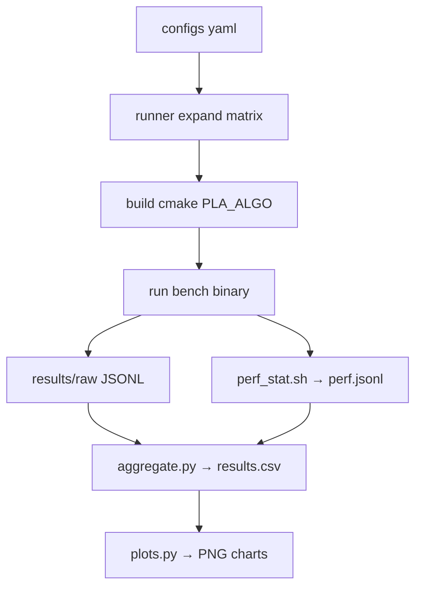

# pla-learned-index-bench

A reproducible benchmark harness for **Piecewise Linear Approximation (PLA)**-based
learned index structures, covering in-memory, dynamic, and on-disk scenarios.

## Overview

| Scenario | Index | PLA source |
|---|---|---|
| `pla_only` | — | standalone build/verify |
| `inmem` | PGM-index | `internal::make_segmentation[_par]` |
| `dynamic` | LOFT | wrapped microbench |
| `ondisk` | Efficient-Disk-Learned-Index | `PGMIndexPage` |

Three PLA algorithms are selectable at compile time (`-DPLA_ALGO=`):

| Algorithm | Space | Pivot | Source |
|---|---|---|---|
| `optimal` | O(n) | — | PGM-index `make_segmentation_par` |
| `swing` | O(1) per seg | segment start | FITing-Tree `lower_slope/upper_slope` |
| `greedy` | O(1) per seg | midpoint of p1,p2 | PLABench §3.3 |

## Repository structure

```
pla-learned-index-bench/
├── CMakeLists.txt
├── third_party/
│   ├── PGM-index/          # submodule — OptimalPLA
│   ├── FITing-Tree/        # submodule — SwingFilter reference
│   ├── LOFT/               # submodule — dynamic workload
│   ├── Efficient-Disk-Learned-Index/  # submodule — on-disk benchmark
│   └── SOSD/               # submodule — datasets & baselines
├── pla/
│   ├── include/pla/
│   │   ├── pla_api.h       # unified interface
│   │   ├── alg_optimal.h   # OptimalPLA (wraps PGM-index internals)
│   │   ├── alg_swing.h     # SwingFilter
│   │   └── alg_greedy.h    # GreedyPLA
├── adapters/               # minimal patch files per submodule
├── bench/
│   ├── perf_counters.h     # shared HW counter wrapper (Linux perf_event_open)
│   ├── rss.h               # shared RSS measurement (/proc/self/statm)
│   ├── pla_only/           # build + verify only
│   ├── inmem/              # end-to-end lookup
│   ├── dynamic/            # insert/lookup mixed workload
│   └── ondisk/             # page-level fetch strategies
├── tools/
│   ├── runner/run.py       # YAML → matrix → build → run → JSONL
│   └── viz/                # aggregate.py, plots.py
├── scripts/
│   ├── bootstrap_ubuntu22.sh
│   ├── apply_patches.sh
│   ├── drop_caches.sh
│   ├── perf_stat.sh
│   └── datasets/           # gen_synth.py, split_shards.py
├── configs/
│   └── exp_example.yaml
└── results/
    ├── raw/                # per-scenario JSONL
    └── agg/                # results.csv + PNG charts + metadata.json
```

## Quick start (Ubuntu 22.04)

```bash
# 1. Install dependencies
sudo bash scripts/bootstrap_ubuntu22.sh

# 2. Update submodules
git submodule init
git submodule update --remote --recursive

# 3. Apply adapter patches
bash scripts/apply_patches.sh

# 4. Build (OptimalPLA by default)
cmake -S . -B build -DCMAKE_BUILD_TYPE=Release
cmake --build build -j$(nproc)

# 5. Run unit tests
cd build && ctest --output-on-failure && cd ..

# 6. Smoke run (tiny data, fast)
python3 tools/runner/run.py --config configs/exp_example.yaml --smoke

# 7. View results
ls results/raw/*.jsonl
ls results/agg/*.png
```

## Switching PLA algorithm

```bash
# Rebuild with SwingFilter
cmake -S . -B build -DPLA_ALGO=swing
cmake --build build -j$(nproc)

# Rebuild with GreedyPLA
cmake -S . -B build -DPLA_ALGO=greedy
cmake --build build -j$(nproc)
```

The runner (`run.py`) handles this automatically — it rebuilds once per PLA
algorithm before running the corresponding cases.

## Running experiments

The pipeline is YAML-driven. Pick a config from `configs/`, then:

```bash
# Positional or --config flag (both work)
python3 tools/runner/run.py configs/exp_example.yaml
python3 tools/runner/run.py --config configs/exp_example.yaml

# Smoke test: first 4 cases, 100K keys (fast verification)
python3 tools/runner/run.py configs/exp_example.yaml --smoke

# Filter by scenario, PLA algorithm, or both
python3 tools/runner/run.py configs/exp_example.yaml \
    --filter-scenario inmem --filter-pla optimal

# Dry run — print commands without executing
python3 tools/runner/run.py configs/exp_example.yaml --dry-run

# Skip rebuild if you've already built the right PLA_ALGO
python3 tools/runner/run.py configs/exp_example.yaml --no-build
```

The runner handles the full lifecycle per run:
1. Reads the YAML config and expands the Cartesian product of the matrix
2. Groups cases by PLA algorithm, rebuilds CMake once per unique PLA value
3. Executes each benchmark binary, appends JSONL to `results/raw/<scenario>.jsonl`
4. Writes `results/agg/metadata.json` with git revision and platform info
5. Auto-invokes `aggregate.py` and `plots.py`

### Experiment configs

| Config | Scenario family | Description |
|---|---|---|
| `exp_example.yaml` | All four | Quick demo (1M keys synth), used for smoke tests |
| `exp_smoke_sosd.yaml` | pla_only, inmem | Smoke test against real SOSD 1M subset (`data/sosd_fb_1M`) |
| `exp_IMA.yaml` | pla_only | Iso-epsilon baseline curves (sweeps ε=8..8192, threads 1/2/4/8) |
| `exp_IMB.yaml` | inmem | End-to-end lookup with routing comparison (PGM-index vs FITing-Tree) |
| `exp_DWA.yaml` | dynamic | PLA cost in retrain path (90% inserts, 5 ε values) |
| `exp_DWB.yaml` | dynamic | Read/insert ratio sweep (readonly, balanced, write_heavy) |
| `exp_ODA.yaml` | ondisk | Iso-epsilon and iso-RP baseline (maps ε to pages/query) |
| `exp_ODB.yaml` | ondisk | End-to-end iso-epsilon with fixed G1/G2/G3 |
| `exp_ODC.yaml` | ondisk | G1 fetch strategy (0/1/2/3) × PLA interaction |
| `exp_ODD.yaml` | ondisk | G2 prediction granularity (item vs page) |
| `exp_ODE.yaml` | ondisk | G3 page-alignment (on/off) |
| `exp_ODF.yaml` | ondisk | Update workload under hybrid framework (readonly/insert/hybrid) |
| `fb_experiment.yaml` | pla_only, inmem | Real-data config using SOSD Facebook 200M |

## Generating datasets

```bash
# Synthetic lognormal, 200M keys
python3 scripts/datasets/gen_synth.py \
    --dist lognormal --n 200000000 \
    --output data/synth_lognormal_200M.bin

# Split into 4 shards
python3 scripts/datasets/split_shards.py \
    --input data/synth_lognormal_200M.bin \
    --shards 4 --output-dir data/shards/lognormal_200M

# SOSD datasets (fb, books, osm)
# After initialising the SOSD submodule:
cd third_party/SOSD && bash download.sh && cd ../..
```

## On-disk benchmark

```bash
# Run with Efficient-Disk-Learned-Index submodule
cmake -S . -B build -DBUILD_ONDISK=ON
cmake --build build -j$(nproc)

# Drop page cache (requires root)
sudo bash scripts/drop_caches.sh

# Run ondisk bench, strategy 1 (all-at-once prefetch)
./build/ondisk_bench \
    --dataset data/sosd_books_800M.bin \
    --epsilon 128 --algo optimal \
    --fetch-strategy 1 --queries 100000
```

fetch_strategy codes:

| Code | Description |
|------|-------------|
| 0 | one-by-one (touch each page individually) |
| 1 | all-at-once (prefetch entire search range) |
| 2 | all-at-once-sorted (sorted page list) |
| 3 | model-biased (fetch only predicted page) |

Additional on-disk flags:

| Flag | Description |
|------|-------------|
| `--compress` | G4: compress slope/intercept double→float (16.7% index size reduction) |
| `--direct-io` | Bypass OS page cache with `O_DIRECT` + `pread` (default: mmap) |
| `--granularity item\|page` | G2: prediction at item rank vs page number |
| `--page-align` | G3: extend search range to page boundaries |
| `--target-rp N` | iso-RP: binary-search ε to achieve N pages/query target |
| `--workload readonly\|insert\|hybrid` | OD-F: hybrid workload with delta buffer |

## LOFT dynamic benchmark

LOFT requires MKL, jemalloc, and urcu. Falls back to `NaiveDynamic` (sorted vector
+ periodic retrain every 10K inserts) when these are unavailable.

```bash
# With MKL
cmake -S . -B build -DUSE_MKL=ON -DUSE_JEMALLOC=ON -DUSE_URCU=ON
cmake --build build -j$(nproc)
./build/dynamic_bench --algo optimal --epsilon 64 --threads 4 \
    --n 1000000 --insert-ratio 0.5

# Without MKL (NaiveDynamic fallback)
cmake -S . -B build -DUSE_MKL=OFF
cmake --build build -j$(nproc)

# With external dataset (splits into initial keys + insert stream)
./build/dynamic_bench --algo optimal --epsilon 128 \
    --dataset data/sosd_fb_1M --n 100000

# Workload modes
./build/dynamic_bench --workload readonly    # 0% inserts
./build/dynamic_bench --workload balanced    # 50% inserts
./build/dynamic_bench --workload write_heavy # 90% inserts
```

## Hardware perf counters

All four benchmarks collect Linux `perf_event_open` counters directly (cache-misses,
instructions, cycles, branch-misses) and report them in JSONL output. No external
profiling tool needed.

```bash
# Built-in: counters appear automatically in JSONL output
./build/pla_build_bench --epsilon 64 --dataset data/sosd_fb_1M --n 1000000
# → "cache_misses":263214,"instructions":477122454,"cycles":107785023,...

# External perf stat wrapper (averages over 3 runs)
bash scripts/perf_stat.sh \
    --cmd "build/lookup_bench --algo optimal --epsilon 64 --n 1000000" \
    --exp-id lookup_optimal_e64
# Results appended to results/raw/perf.jsonl
```

Peak memory (RSS delta) is also reported as `rss_mb` in every benchmark's JSONL output.

## Output format

Each benchmark appends one JSONL line to `results/raw/<scenario>.jsonl`:

```json
{
  "exp_id": "demo_optimal_e64",
  "scenario": "inmem",
  "index": "PGM-index",
  "pla": "optimal",
  "epsilon": 64,
  "threads": 1,
  "dataset": "synth_uniform_1M",
  "workload": "readonly",
  "build_ms": 12.3,
  "seg_cnt": 4821,
  "bytes_index": 154272,
  "ops_s": 8234567.0,
  "p50_ns": 120.0,
  "p95_ns": 245.0,
  "p99_ns": 380.0,
  "cache_misses": 138490,
  "instructions": 48299108,
  "cycles": 67325526,
  "branch_misses": 952380,
  "rss_mb": 23,
  "fetch_strategy": -1
}
```

Optional fields per scenario:

| Field | Scenario | Meaning |
|---|---|---|
| `routing`, `index_levels`, `seg_cnt_l1` | inmem | PGM-index recursive layer info |
| `retrain_ms`, `retrain_count`, `retrain_p50_ms` | dynamic | Retrain cost statistics |
| `io_pages_mean`, `io_pages_p50/95/99` | ondisk | I/O pages per query distribution |
| `compress`, `bytes_compressed` | ondisk | G4 compression metrics |
| `direct_io` | ondisk | Whether O_DIRECT was used |
| `granularity`, `page_align` | ondisk | G2/G3 settings |
| `seg_len_mean/p50/p95`, `slope_mean/std` | pla_only | Segment geometry statistics |

Aggregation: `python3 tools/viz/aggregate.py` → `results/agg/results.csv`

Plots: `python3 tools/viz/plots.py` → 6 PNG charts in `results/agg/`

## Pipeline diagram


```mermaid
flowchart TD
    A[configs yaml] --> B[runner expand matrix]
    B --> C[build cmake PLA_ALGO]
    C --> D[run bench binary]
    D --> E[results/raw JSONL]
    E --> F[aggregate.py → results.csv]
    F --> G[plots.py → PNG charts]
    D --> H[perf_stat.sh → perf.jsonl]
    H --> F
```

## Reproducibility

Every run writes `results/agg/metadata.json` containing:
- `git_rev`: HEAD commit hash
- `submodule_hashes`: per-submodule commit hashes
- `platform`: OS/kernel/CPU info
- `lscpu`: full CPU topology

## CI

GitHub Actions (`.github/workflows/ci.yml`) runs:
- **IM-A**: pla_only + inmem smoke (all 3 PLA algorithms, tiny data)
- **DW-A**: dynamic_bench compile-only (MKL not available in CI runners)

## License

Apache-2.0 (this harness).  Third-party submodules retain their own licenses:
- PGM-index: Apache-2.0
- FITing-Tree: Apache-2.0
- LOFT: see `third_party/LOFT/LICENSE`
- Efficient-Disk-Learned-Index: see submodule LICENSE
- SOSD: MIT

## References

- PGM-index: Ferragina & Vinciguerra, VLDB 2020
- FITing-Tree: Galakatos et al., SIGMOD 2019
- LOFT: VLDB 2023
- Efficient-Disk-Learned-Index: SIGMOD 2024
- PLABench: Maltenberger et al., DaMoN 2022
- SOSD: Marcus et al., VLDB 2020
